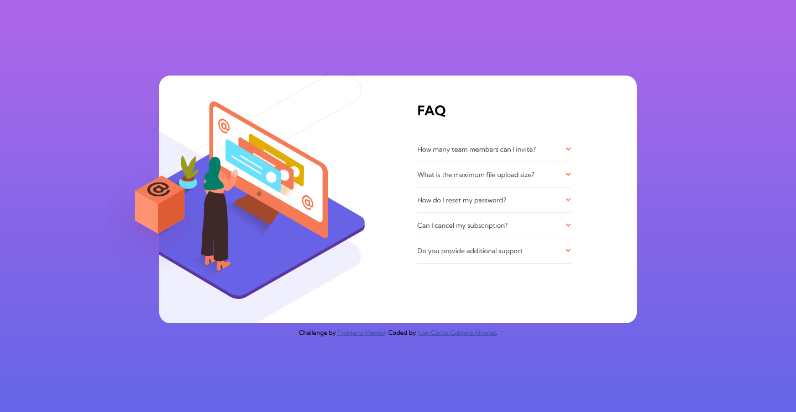

# Frontend Mentor - FAQ accordion card solution

Esta es la Solución al Desafío [FAQ accordion card challenge on Frontend Mentor](https://www.frontendmentor.io/challenges/faq-accordion-card-XlyjD0Oam).

## Tabla de Contenido

- [Introducción](#introducción)
  - [El Desafío](#el-desafio)
  - [Captura de Pantalla](#captura-de-pantalla)
  - [Links](#links)
- [Mi Proceso](#mi-proceso)
  - [Tecnologías](#tecnologías)
- [Autor](#autor)

## Introducción

### El Desafío

Realizar una tarjeta de Preguntas Frecuentes lo mas fiel al diseño que se entrega.

los Usuarios deben ver de forma óptima la página independientemente del dispositivo en que lo hagan.

Se debe realizar sin utilizar JavaScript.

### Captura de pantalla

### Links

- Solución URL: [Solución]()
- Live Site URL: [Site]()

## Mi Proceso

### Tecnologías

- Flexbox
- BEM
- SASS/SCSS

## Autor

- Frontend Mentor - [@jcarloscab](https://www.frontendmentor.io/profile/jcarloscab)
- GitHub - [@jcarloscab](https://github.com/jcarloscab)
